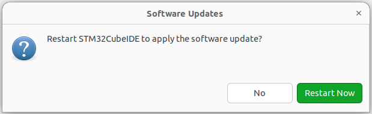

# How to install TTCN-3 test environment to validate the UDP server implementation

***Note:*** If you have installed STM32Cube IDE, which is based on Eclipse IDE, you can skip steps 1 - 2.

1. Download the Eclipse IDE installation package usign the next link

https://www.eclipse.org/downloads/

2. Install Eclipse C/C++ Development Tool IDE

a) Launch eclipse-inst

b) Follow the instructions to install Eclipse C/C++ Development Tool IDE

3. Download and install Eclipse Titan TTCN-3 compiler

***Note:*** if you are using a platform other than Ubuntu Linux, you should read the relevant titan.core/README.platform to install titan on your platform. 

Here is a short description how to install Eclipse Titan on Ubuntu Linux:

a) Clone Titan git repository:
~~~
$ cd ~
$ git clone https://gitlab.eclipse.org/eclipse/titan/titan.core.git
~~~

b) Install additional required packages:
~~~
sudo apt-get update -y
sudo apt-get install g++ expect libssl-dev libxml2-dev libncurses5-dev flex bison libedit2 libedit-dev
~~~

c) Build and install Eclipse Titan compiler:
~~~
$ cd ~/titan.core
$ make JNI=no install
~~~

d) Add required paths into ~/.bashrc :
~~~
export TTCN3_DIR=/home/<userid>/titan.core/Install
export PATH=/home/<userid>/titan.core/Install/bin:${PATH}
export LD_LIBRARY_PATH=/home/<userid>/titan.core/Install/lib:${LD_LIBRARY_PATH} 
~~~

e) Reboot or logout/login:
~~~
$ sudo reboot
~~~ 

4. Download and install the Titan Designer Plug-in

a) Use the folloving link to download the Titan Designer Plug-in:

https://www.eclipse.org/downloads/download.php?file=/titan/TITAN_Designer_and_Executor_plugin-8.3.0.zip

b) Open Eclipse C/C++ IDE or STM32Cube IDE and install the downloaded plug-in:

Click 'Help->Install New Software..', then click 'Add..' button,
after that click "Archive.." button and select the TITAN_Designer_and_Executor_plugin-8.3.0.zip file location

5. Setup path to the Eclipse Titan compiler

Click 'Windows->Preferences->TITAN Preferences', then click 'Browse...' button to select Titan installation path

6. Import udp_server_ttcn_test_suit project into Eclipse IDE

Click 'File->Import...', you will see an import window, select 'Existing project into Workspace' and click 'Next'.

7. Compile udp_server_ttcn_test_suit

Select imported project in the Project Explorer at the left side of the IDE, then click 'Project->Clean...'

You will see the compilation process in the Console window at the bottom of the IDE:

~~~
makedepend: warning:  ../src/udp_client.c (reading /usr/include/unistd.h, line 1218): cannot find include file "bits/unistd_ext.h"
	not in ./bits/unistd_ext.h
	not in /home/petro/titan.core/Install/include/bits/unistd_ext.h
	not in ./bits/unistd_ext.h
	not in ../src/bits/unistd_ext.h
	not in /usr/include/bits/unistd_ext.h
Operation finished successfully.
sh -c make all  -j 8  
g++ -c -DLINUX -I. -I/home/petro/titan.core/Install/include -I. -I../src -Wall -O2  -o udp_server_test_suit.o udp_server_test_suit.cc
g++ -c -DLINUX -I. -I/home/petro/titan.core/Install/include -I. -I../src -Wall -O2  -o PCOType.o ../src/PCOType.cc
g++ -c -DLINUX -I. -I/home/petro/titan.core/Install/include -I. -I../src -Wall -O2  -o udp_client.o ../src/udp_client.c
g++  -o udp_server_ttcn_test_suit udp_server_test_suit.o PCOType.o udp_client.o \
-L/home/petro/titan.core/Install/lib -L/home/petro/titan.core/Install/lib -L/home/petro/titan.core/Install/lib \
-lttcn3-parallel -lcrypto \
-lxml2 -lpthread  -lrt \
|| if [ -f /home/petro/titan.core/Install/bin/titanver ]; then /home/petro/titan.core/Install/bin/titanver udp_server_test_suit.o PCOType.o udp_client.o; else : ; fi
Operation finished successfully.
~~~

8. Run udp_server_ttcn_test_suit

8.1. Run udp_server_ttcn_test_suit with the test udp server

a) Run ./start_server.sh in Ubuntu terminal:

~~~
user@host:~/GL-ESK-TEST-SUIT$ ./start_server.sh 
Launching UDP server...
Press 'exit' to exit
[udp_server.c : udp_server_init: 56]: UDP Server is bound to port 5678

~~~

b) Run udp_server_ttcn_test_suit

Switch perpective by clicking 'Windows->Perspective->Open Perspective->Other...', select 'TITAN Executing'

Select the project in the Project Explorer, right click on the project and select 'Run As->TITAN Parallel launcher' in the context menu.

The tests fail due to the test server sends "test_server" as an answer to the "sversion" command.
That means the student hasn't completed his/her task yet.
The Console window should display the following message:

~~~
MTC@DellVostro: Message enqueued on MyPCO_PT from system charstring : "test_server\r\n" id 1
MTC@DellVostro: Receive operation on port MyPCO_PT succeeded, message from system(): charstring : "test_server\r\n" id 1
MTC@DellVostro: Message with id 1 was extracted from the queue of MyPCO_PT.
MTC@DellVostro: Removing unterminated mapping between port MyPCO_PT and system:MyPCO_PT.
MTC@DellVostro: Port MyPCO_PT was unmapped from system:MyPCO_PT.
MTC@DellVostro: Port MyPCO_PT was stopped.
MTC@DellVostro: Test case tc_CheckServerVersion finished. Verdict: fail
MTC@DellVostro: Execution of control part in module udp_server_test_suit finished.
MC@DellVostro: Test execution finished.
MC@DellVostro: Terminating MTC.
MTC@DellVostro: Verdict statistics: 0 none (0.00 %), 30 pass (96.77 %), 0 inconc (0.00 %), 1 fail (3.23 %), 0 error (0.00 %).
MTC@DellVostro: Test execution summary: 31 test cases were executed. Overall verdict: fail
MC@DellVostro: MTC terminated.
MC@DellVostro: Shutting down session.
MC@DellVostro: Shutdown complete.
~~~

If it fails for some other reason, you need to investigate the cause of the TC failure by reading the generated logs.

Switch perpective by clicking 'Windows->Perspective->Open Perspective->Other...', select 'TITAN Editing'.

Open 'udp_server_ttcn_test_suit->bin->logs' to see all generated logs.

If the Project Explorer doesn't contain 'bin' subdirectory, setup the filter by clicking 'Filter and Customizations' in the right top corner of the Project Explorer window:

Make sure the following checkboxes are not selected:
* TITAN excluded resources
* TITAN working directory

Open udp_server_ttcn_test_suit.< hostname >-hc_merged.log to investigate the cause of the TC failure:
~~~
MTC@DellVostro: Verdict statistics: 0 none (0.00 %), 31 pass (100.00 %), 0 inconc (0.00 %), 0 fail (0.00 %), 0 error (0.00 %).
~~~

There are several verdicts:
* none - number of test cases that hasn't been run
* pass - number of passed TCs
* inconc - number of inconclusive TCs
* fail - number of failed TCs
* error - number of TCs that contain errors

8.2. Run udp_server_ttcn_test_suit with the udp server launched on GL Embeded Starter Kit 

a) Connect your board to Ethernet network. 

Make sure the Ethernet link is up and the board IP is in the same network with the test executor.

b) Change the following line 'udp_server_ttcn_test_suit->src->PCOType.cc:109' with your board's IP address:
~~~
	std::string ip = "127.0.0.1";
~~~

Compile the test suit as described in 7, then follow the instructions in 8.1.b.

c) If successful, the Console window should display a message similar to the following:

~~~
MTC@DellVostro: Message enqueued on MyPCO_PT from system charstring : "udp_srv_petro_shevchenko_23022023" id 1
MTC@DellVostro: Receive operation on port MyPCO_PT succeeded, message from system(): charstring: "udp_srv_petro_shevchenko_2302202" id 1
MTC@DellVostro: Message with id 1 was extracted from the queue of MyPCO_PT.
MTC@DellVostro: Removing unterminated mapping between port MyPCO_PT and system:MyPCO_PT.
MTC@DellVostro: Port MyPCO_PT was unmapped from system:MyPCO_PT.
MTC@DellVostro: Port MyPCO_PT was stopped.
MTC@DellVostro: Test case tc_CheckServerVersion finished. Verdict: pass
MTC@DellVostro: Execution of control part in module udp_server_test_suit finished.
MC@DellVostro: Test execution finished.
MC@DellVostro: Terminating MTC.
MTC@DellVostro: Verdict statistics: 0 none (0.00 %), 31 pass (100.00 %), 0 inconc (0.00 %), 0 fail (0.00 %), 0 error (0.00 %).
MTC@DellVostro: Test execution summary: 31 test cases were executed. Overall verdict: pass
MC@DellVostro: MTC terminated.
MC@DellVostro: Shutting down session.
MC@DellVostro: Shutdown complete.
~~~
The first line in the example above should contain student's first and last name:
~~~
MTC@DellVostro: Message enqueued on MyPCO_PT from system charstring : "udp_srv_petro_shevchenko_23022023" id 1
~~~

8.3. Run udp_server_ttcn_test_suit from the Linux terminal

a) Start the implemented or test udp server as described above

b) Open the Linux terminal and launch udp_server_ttcn_test_suit:
~~~
user@host:~$ ttcn3_start $HOME/GL-ESK-TEST-SUIT/udp_server_ttcn_test_suit/bin/udp_server_ttcn_test_suit $HOME/GL-ESK-TEST-SUIT/udp_server_ttcn_test_suit/src/udp_server_test_suit.cfg udp_server_test_suit
~~~
